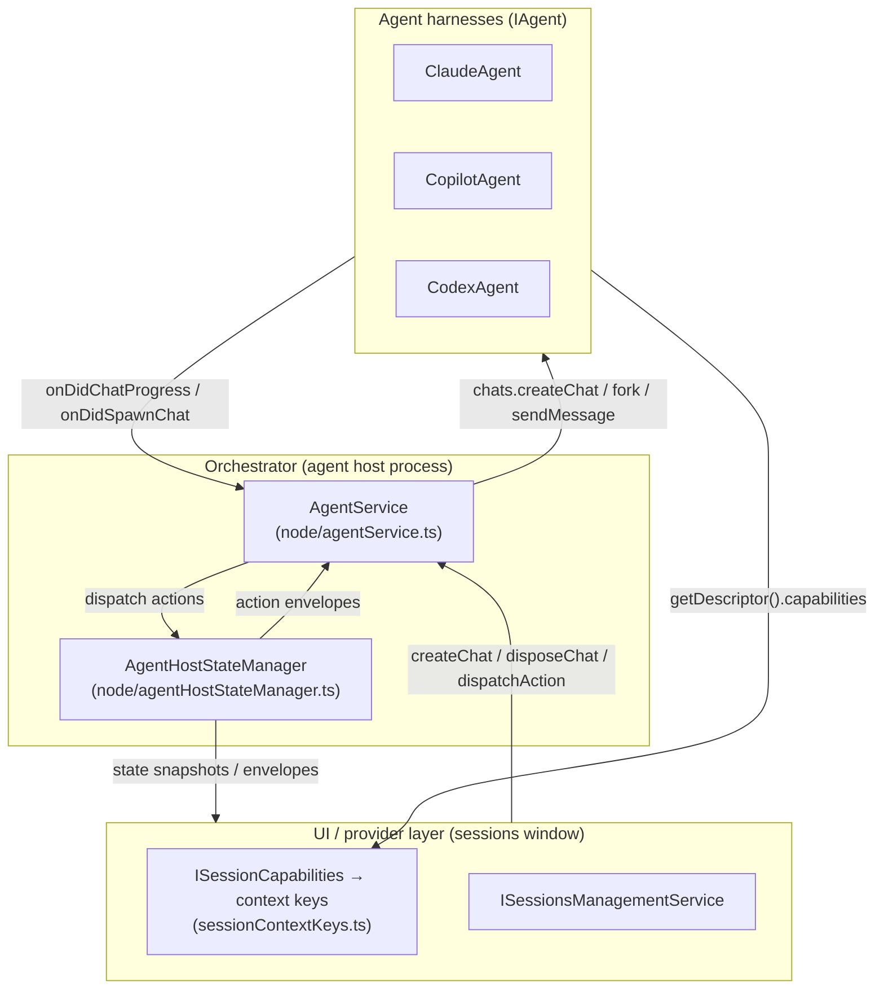
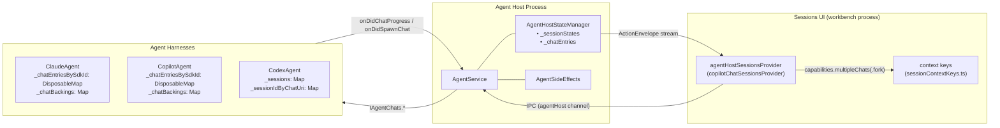
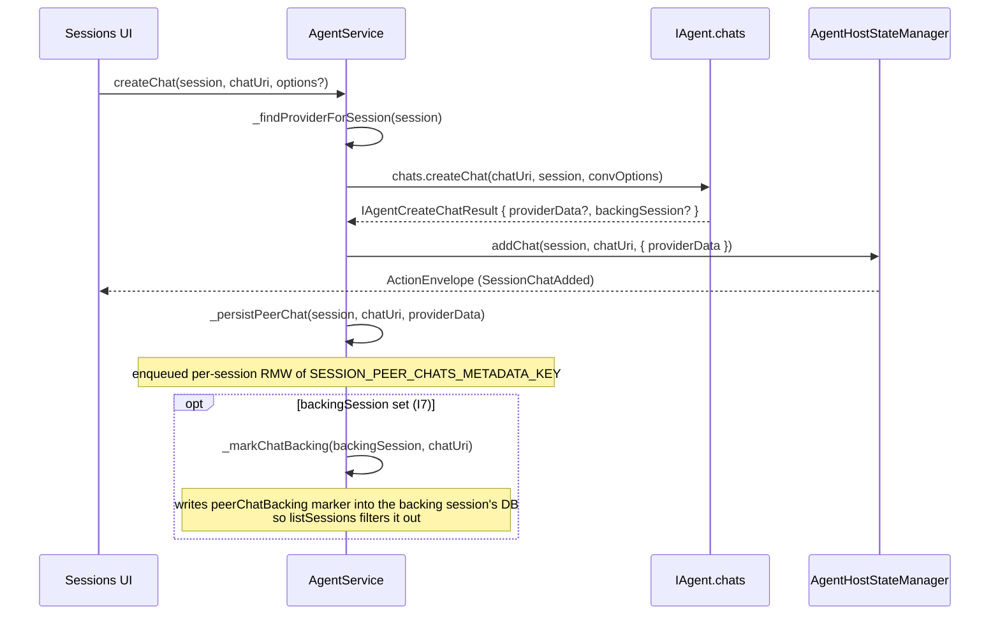
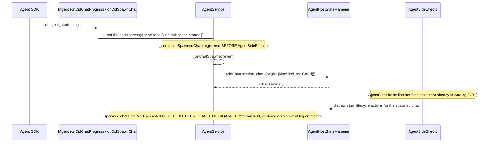
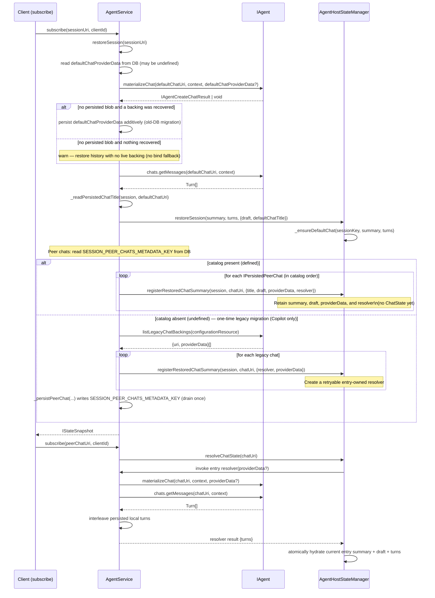
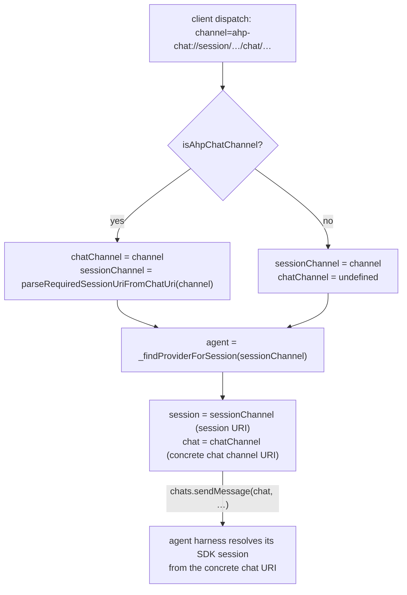

<!--
  AGENTS.md
  Living spec — keep in sync with code after each significant change.
  See: node/agentService.ts, node/agentHostStateManager.ts,
       node/claude/claudeAgent.ts, node/copilot/copilotAgent.ts,
       node/codex/codexAgent.ts, node/agentSideEffects.ts,
       common/agent.ts (IAgent, IAgentChats, IAgentCapabilities),
       common/agentService.ts (IAgentService, IAgentConnection).
-->

# Multi-Chat Architecture

> **Status: COMPLETE** (2026-07-01)
> All waves A–D and gates G-B1, G-C1, G-C2, G-D1 are done. Codex, Claude, and
> Copilot all use the unified orchestrator path.
>
> Codex advertises `multipleChats: { fork: true }`. Host-only capability checks
> and provider-independent conformance scenarios run in replay; model-backed
> Codex peer/fork parity remains gated by `supportsMultipleChatsE2E` /
> `supportsChatForkE2E` until the documented live-recording defect is fixed.
>
> The *operational* chat surface (send/abort/model/agent/history) is fully
> chat-addressed and uniform across harnesses. Session ownership lives in the
> orchestrator: it drives every harness through the chat-surface seam — see
> [§7 Session Ownership (T2/T4)](#7-session-ownership-t2t4--the-orchestrator-owns-the-session).

---

## 1. Mental Model

### Three distinct concepts

| Term | What it is | Owner |
|------|-----------|-------|
| **SDK conversation** | A provider-native conversation/thread with its own restore identity and runtime resources. | Agent harness |
| **Chat** | A thread of turns addressed by a chat channel URI. AH owns its URI and membership; the agent owns its SDK backing. | `AgentService` + agent harness |
| **Orchestrator session** | The protocol-visible entity that bundles a session with its chat catalog, state, and persistence. The orchestrator owns the catalog (which chats exist), the default-chat pointer, and all persistence. | `AgentService` + `AgentHostStateManager` |

### Guiding principles

- **"Represent, don't orchestrate."** The agent harness creates and drives SDK
  chats; the orchestrator records what exists and routes protocol
  actions. No agent-specific logic leaks into `AgentService` or
  `AgentHostStateManager`.
- **Composition over inheritance.** All harnesses share one membership path
  (`addChat`/`removeChat`), one persistence path (`SESSION_PEER_CHATS_METADATA_KEY`),
  and one restore path (`registerRestoredChatSummary` + `resolveChatState`).
  Per-harness features are expressed
  through `IAgentCapabilities` flags, not `if (provider === 'claude') ...`
  branches.
- **Single catalog path.** Whether a chat is created by the user ("Add Chat")
  or spawned by the harness (subagent tool call), it enters the catalog through
  exactly one path (`AgentHostStateManager.addChat`). See invariant I4 below.

### Terminology convention: "session" is overloaded — read it by layer

The word **session** means two different things depending on which side of the
seam you are on. To avoid confusion, follow this convention:

| Where | What `session` means | Notes |
|-------|----------------------|-------|
| AHP wire protocol (`common/state/protocol/`) and the orchestrator (`AgentService`, `AgentHostStateManager`) | The **AH session** — the protocol-visible grouping of a default chat plus its peer chats. | This is the vocabulary the generated protocol types pin (`SessionState`, `SessionSummary`, `sessionAdded`, ...); it is immutable and authoritative. |
| Inside an agent harness (`node/claude`, `node/copilot`, `node/codex`) | The agent's **own SDK / provider session** — the provider's native concept (Codex calls it a *thread*). The agent has no notion of the AH grouping; it only ever deals in chats and its own SDK sessions. | Prefer the provider's native term where one exists (Codex "thread"); otherwise spell it out as "SDK session" / "provider session" in comments and local names wherever the two could be confused. |
| The `IAgent` seam (`chats.*` plus chat metadata/configuration events) | Operations receive an exact chat plus opaque persistence/configuration scopes. | Providers never receive AH ownership or chat-role fields. |

**Why we do not rename the agents' "SDK session" symbols:** the generated
protocol fixes "Session" = AH session across hundreds of references we cannot
change. Provider-internal SDK sessions remain native runtime concepts, while the
chat seam exposes no AH session ownership.

---

## 2. Ownership and Layering



### Agent layer (`common/agent.ts:IAgent`)

Responsible for:
- Creating and owning SDK chats (`chats.createChat`, with optional fork input).
- Reading history (`chats.getMessages`).
- Emitting progress signals (`onDidChatProgress`).
- Emitting membership events for harness-spawned chats (`onDidSpawnChat`, `onDidEndChat`).
- Re-attaching a chat's backing on restore (`materializeChat`) — including the session's default chat.
- Advertising static capability flags (`getDescriptor().capabilities`).

Agents do **not** maintain the chat catalog, persist membership, know whether a chat is the session or a peer, or inject `AgentHostStateManager`. Host facts they genuinely need (subagent origin, session customizations, prompt-cache metadata, session-title changes, active-client chat membership) arrive through typed seams — see §8.

**File organization rule:** `common/agent.ts` holds the *provider model* — `IAgent` and every type/helper/signal reachable from it (chat lifecycle, create/materialize/legacy-migration payloads, config-resolution parameters, `AgentSignal`/`AgentSession`). `common/agentService.ts` holds the *orchestrator-facing service surface* — `IAgentService`, `IAgentConnection`, `IAgentHostService`, settings/env constants, and diagnostics types. The dependency is one-directional: `agentService.ts` may import from `agent.ts`, but `agent.ts` must never import from `agentService.ts`. `agentService.ts` re-exports the public provider types from `agent.ts` for call-site compatibility; new provider code should import directly from `agent.ts`.

### Orchestrator layer

**`AgentService` (`node/agentService.ts`):**
- Owns the `(session, chat)` → `(agent, session URI, chat URI)` mapping.
- Owns `_providers`, `_sessionToProvider`, and `_findProviderForSession` (which falls back through the session URI's scheme when a session was restored without an `AgentService.createSession` call in this process lifetime).
- Owns `AgentSessionCatalog` around `AgentSessionRegistry`, the durable source of truth for which sessions exist. The catalog boundary enumerates registry rows, enriches each exact row through `IAgent.getChatMetadata` when available, and classifies cold provisional drafts; `listSessions` applies the remaining DB/live-state presentation overlays.
- Dispatches user-driven chat lifecycle (`createChat`, AHP `disposeChat` translated to Harness `deleteChat`) to `chats.*`.
- Disposes every catalog chat in stable order (peers first, initial chat last); releases every catalog chat on idle eviction.
- Derives the exhaustive per-operation `IAgentChatContext` (persistence scope, opaque configuration scope, catalog origin, host customizations) via the single `createAgentChatContext` helper.
- Supplies complete resolved `IAgentCreateChatOptions` (`workingDirectories`, `project`, provider config, model/agent, active client, and fork/import/side-chat source) on every creation.
- Records side-chat provenance in the catalog but leaves hidden context injection and visible-history filtering to the provider. The source is a stable turn id; active-turn partial response and selected text are immutable creation-time snapshots.
- Passes the full ordered `workingDirectories` set and the initiating `AgentHostClientType` on each send while still supplying transient chat context. Providers launch in index 0, retain additional roots, and attribute usage/telemetry to the correct client surface.
- Persists and restores the orchestrator-owned peer-chat catalog (`SESSION_PEER_CHATS_METADATA_KEY` in the session database, serialized per session via `_peerChatCatalogWrites`).
- Suppresses a chat's separately-enumerable backing SDK session (when `IAgentCreateChatResult.backingSession` is set): marks it via `_markChatBacking` and filters it out of `listSessions` (invariant I7).
- Routes harness-spawned chats into the catalog (`_onChatSpawned`, `_onChatEnded`).
- Owns the restore flow (`restoreSession`, `_restorePeerChats`).

**`AgentHostStateManager` (`node/agentHostStateManager.ts`):**
- Holds the authoritative in-memory state tree:
  - `_sessionStates: Map<string, ISessionEntry>` — per-session `SessionState` + catalog timestamps.
  - `_chatEntries: Map<string, IChatEntry>` — one entry for every chat catalog
    item. An entry owns its current `ChatSummary`, optional hydrated
    `ChatState`, opaque `providerData`, and (for restored peers) resolver,
    in-flight promise, and invalidation state.
- Owns `_ensureDefaultChat`: creates the default `ChatState` (URI derived deterministically from the session URI via `buildDefaultChatUri`) at create/restore time.
- `addChat`/`registerRestoredChatSummary`/`removeChat`: the paths for live,
  restored, and removed catalog membership.
- `getChatState` is a synchronous, no-I/O peek for reducers and diagnostics.
  Interaction paths use `resolveChatState`, which coalesces one peer's
  materialization, retries failures, and atomically publishes complete state.
- `getChatOrigin` reads a chat's origin from its `ChatSummary`, so a restored
  chat's origin is available before its state is ever hydrated.
- Session-level active-turn tracking via `_sessionsWithActiveTurn` (a set of chat URIs per session, so multi-chat sessions running concurrent turns stay correct).

### UI/provider layer (`sessions/services/sessions/common/session.ts:ISessionCapabilities`)

- Protocol `AgentCapabilities` (`multipleChats?: { fork?: boolean }`) flows from `AgentInfo.capabilities` (protocol) through the provider adapter into `ISession.capabilities` (`ISessionCapabilities`), whose `supportsMultipleChats`/`supportsFork` flags derive from the presence of `multipleChats` and `multipleChats.fork`, and from there into VS Code context keys (`sessionContextKeys.ts:SessionSupportsMultipleChatsContext`, `SessionSupportsForkContext`).
- UI actions read context keys — no provider-id switches.

---

## 3. Key Invariants

**I1 — `providerData` is opaque.**
The state-manager-owned `IChatEntry` stores the blob returned by
`chats.createChat` verbatim. Neither `AgentService` nor
`AgentHostStateManager` parses, validates, or mutates it. It is round-tripped
to the agent verbatim on restore via
`materializeChat(chat, context, providerData)`.

Opaque to the host, but not arbitrary for the provider: whatever id the blob
carries is the *only* handle the provider gets back on the next process, so it
must name the provider's own durable runtime — the key that runtime is
registered and addressed under — and not a transient SDK handle that the
provider decouples from it. Codex's session-backing chat is the worked example:
its runtime keeps the host-minted session id and records its app-server thread
id in a metadata overlay, so a thread-keyed blob would restore the runtime under
an id nothing addresses it by (leaving every notification unroutable) and would
go stale the moment a rematerialization mints a new thread. Where the two
genuinely coincide — a Codex peer chat or fork, whose runtime *is* its thread —
recording the thread id is the same thing as recording the runtime id.
`IAgentCreateChatResult.backingSession` remains the place to name a separately
enumerable SDK conversation (I7); it is not a second id channel for the blob.

**I2 — `sessionUri` and `chatChannelUri` are never overloaded.**
A session URI (`ahp-copilot://`, `ahp-claude://`, …) identifies a session. A chat channel URI (`ahp-chat://…`) identifies a chat within a session. The two schemes are structurally distinct; `isAhpChatChannel` / `parseDefaultChatUri` / `buildDefaultChatUri` are the only crossing points. Passing a chat URI where a session URI is expected (or vice versa) is a bug.

**I3 — The default chat uses the same explicit backing contract as every chat.**
The default chat URI is derived from the AH session URI, but its provider identity is opaque `providerData`. Claude and Copilot mint independent SDK ids, return them from `createChat`, and restore them through `materializeChat`; equality with the AH session id is never assumed and there is no identity-reuse bind fallback. Codex persists its explicit thread mapping. AH never depends on provider identity reuse for ownership or enumeration.

**I4 — Single catalog path (spawn channel).**
Both user-driven chats (`AgentService.createChat` → `addChat`) and harness-spawned chats (`AgentService._onChatSpawned` → `addChat`) go through `AgentHostStateManager.addChat`. The spawn-channel listener is registered **before** `AgentSideEffects` during `registerProvider` (`node/agentService.ts:registerProvider`) to guarantee the chat exists in the catalog before any turn actions arrive for it (DR1 deterministic sequencing).

**I5 — Orchestrator peer-chat catalog is the restore source of truth (with one-time legacy migration).**
The orchestrator persists additional chats in `SESSION_PEER_CHATS_METADATA_KEY` and the initial chat's opaque backing in `defaultChatProviderData`. Restore materializes both through the same provider-data contract — `materializeChat` is the *only* way a default chat is re-attached. When a legacy session has no persisted blob, whatever `recoverLegacyChat` recovers is persisted additively under `defaultChatProviderData` so later restores read it directly; an already-canonical blob is never rewritten. If neither a persisted nor a recovered backing exists, the host restores history and logs that the chat has no live backing rather than falling back to identity reuse. A missing additional-chat catalog triggers the one-time `listLegacyChatBackings` migration. Harness-spawned chats remain transient and are re-derived from tool-origin state. `_persistDefaultChatBacking` keeps its two writes independent — a failed provider-data write cannot skip `_markChatBacking` — but propagates the provider-data failure after the marker attempt. Create compensates the provider backing and reservation; provisional materialization stays `Creating` and retries instead of publishing an unrestorable `SessionReady`.

**I6 — `_findProviderForSession` not `_sessionToProvider`.**
The `_sessionToProvider` map is populated only by `AgentService.createSession`. A restored session (alive in the state manager after a host restart but never created in this process) is absent from it. `_findProviderForSession` (`node/agentService.ts:AgentService._findProviderForSession`) falls back to the session URI scheme, which is what makes restored sessions work.

**I7 — A chat backing SDK session must never surface as a top-level session.**
Some agents store all SDK conversations in one catalog. `IAgentCreateChatResult.backingSession` lets the orchestrator mark any internal chat backing, including the default Claude backing. New backings never enter `AgentSessionRegistry`; the durable marker and `_unpersistedChatBackings` remain defensive filters for stale registry rows created by older builds. A transient marker failure is retried once and never fails chat creation. Default and peer restore both feed a returned `backingSession` through `_persistDefaultChatBacking` / `_markChatBacking`, so a backing restored on a fresh process cannot leak into the top-level catalog.

**I9 — Identity is reserved before native creation; Ready is a durable commit.**
`createSession` mints or validates the AH session URI, registers that identity, and persists its provisional marker before `chats.createChat` may create a provider-native backing. `_sessionCreationReservations` hides the row from concurrent list refreshes until live state exists; after a crash the in-memory guard disappears and a marker-only (or no-DB) row with no provider metadata is swept. A crash can therefore leave an AH reservation to sweep, but cannot leave an unowned native session. Provider-create failure compensates both sides. `SessionReady` is published only after the default backing plus the session's restore-critical facts (`workspaceless`, provisional marker, multi-root metadata, config) have committed; provisional materialization uses the same gate and remains retryable in `Creating` on a write failure.

**I8 — Providers are given host facts; they must not re-derive them.**
Everything a provider needs about a chat and its owning session is published on
a typed seam at the call boundary (see §8). Providers do not inject
`AgentHostStateManager` or recover subagent origin or customizations by parsing
a chat URI. New provider code must consume the seams.

---

## 3a. Fumie-Owned Session Catalog

`AgentSessionRegistry` (`node/agentSessionRegistry.ts`) stores
`{ sessionUri → { provider, startTime } }` in the orchestrator-owned
database. Fumie products place it at `FUMIE_HOME/sessions/catalog.db`; products
without a Fumie home retain the historical profile-local `agent-host.db`.
This table is the only source of user-visible top-level
membership. Provider-native `listLegacyChats` results are never imported or
unioned into `listSessions`; unregistered native sessions remain invisible.

A successful explicit `createSession` reserves its registry identity before
calling the provider, then announces state only after provider creation. An
explicit `restoreSession` uses `registerIfNotTombstoned`, while definitive
delete atomically tombstones and unregisters. Registration preserves the first
provider and creation time for a URI, and a requested URI whose provider does
not match the selected harness is rejected before provider creation.

`listSessions` enumerates the registry, enriches each exact row with
`getChatMetadata`, then applies persisted and live state overlays. Missing
provider metadata falls back to the immutable registry identity rather than
removing the row. State-only top-level summaries are not a second membership
path. A provisional session (harness has not yet materialized a real SDK
backing) is registered and announced immediately, same as any other session;
only `SessionReady` waits for provider materialization.

Only the *read* accessors for the legacy global and per-provider backfill
markers remain — `AgentSessionRegistry.isBackfilled` / `isProviderBackfilled`
over `AgentHostDatabase.isSessionRegistryBackfilled` / `isProviderBackfilled` —
so an older profile is still interpreted correctly. Their writers, and the
`isEmpty` registry diagnostic, are gone; the metadata rows and the `migrations`
array are append-only and untouched, so an old profile stays readable either
way. Current `AgentService` neither runs provider backfill nor writes any
marker. Provider enumeration remains only
behind explicit restore compatibility and the separate one-time migration of
a restored session's internal peer-chat backing catalog. One consequence worth
stating plainly: the `migrateLegacyCopilotCliEnabled` setting and Copilot's
`withSessionEhcliAdoptable` adoptable-legacy marker are now dead ends in
practice. Nothing calls `listLegacyChats` during ordinary catalog enumeration
any more — that was the removed backfill sweep — and nothing subscribes to
`CopilotAgent.onDidChangeChatList` either, so an un-adopted extension-host
Copilot CLI session is never surfaced into the list regardless of the setting.
The setting, the marker, and the adopt-on-open path in `_doRestoreSession`
still exist and still work for a session URI a caller already has in hand, but
there is no producer left that would ever hand one out.

Internal default/peer-chat backings are never intentional registry members.
Their durable backing marker and the in-process failed-write suppression are
retained defensively so stale rows created by an older build do not surface.

### Provisional drafts and host-side archive

A *provisional* session is one that is registered and announced before any
harness-native backing exists. Two producers create one deliberately: an
ordinary `createSession` whose harness has not materialized a default chat yet
(every session passes through this state on its way to `SessionReady`), and the
editor window's untitled composer — `IAgentHostUntitledProvisionalSessionService`
for `agent-host-<provider>:/untitled-<uuid>` chat resources — which creates a
backend session up front so its config chips have a reducer-owned `SessionState`
to mutate before the first Send. The **Agents window's composer is not a
producer**: its `NewSession` draft is client-local and issues no `createSession`
(and no `disposeSession`) until the user actually sends, so an abandoned
Agents-window draft leaves no row here at all. Builds that predate that change
did create one eagerly, so their leftover rows are still in the wild and are
handled by the same classification and sweep described below.

A live provisional session's state is created before
`AH_META_PROVISIONAL_DB_KEY` is persisted to its session database
(`_persistProvisionalMarker`, writing an `IProvisionalDraftMarker` that carries
the create-time `workingDirectories`) — deliberately in that order, so a
concurrent `listSessions` can never mistake a live draft for an orphan. The
write is awaited and retried before create returns. The marker is cleared in
the same required-facts commit that lets `_onDidMaterializeChat` publish
`SessionReady`; a backing-receipt or required-facts failure leaves the session
`Creating` and retryable.

A registry row the harness can no longer describe (no `getChatMetadata`
result) is classified by `AgentSessionCatalog.classifyColdProvisionalDraft`: marker present and
no live state → a cold provisional draft. A row registered by a build that
predates the marker counts as one too when its session database shows it was
never materialized (no `agentHost.workspaceless` flag — written unconditionally
at materialization — and no `configValues` / peer-chat catalog). Additionally `untouched` (no
persisted `customTitle`, not archived) marks it an orphan — typically an
untitled editor-window composer draft abandoned by a quit or crash, or a
legacy Agents-window draft left by a build that still created its backend
session eagerly. `listSessions` sweeps an
untouched orphan (`_sweepOrphanedProvisionalDraft` → `disposeSession`:
unregister + tombstone + delete its data) instead of listing an unopenable
"New Session" ghost. A *touched* draft (renamed or archived) stays listed
(registry-identity fallback row, with DB overlays) and is revived on open:
`restoreSession` → `_restoreSessionState` calls `_reviveProvisionalDraft`,
which re-runs `createSession` at the *same* URI with the marker's original
`workingDirectories`, then replays the persisted title/archived/read flags
onto the fresh state via `dispatchServerAction` (and `retainSession` — the
public wrapper of `_markSessionUsed` — when archived, so the freshly revived
draft is retained against the orphan sweep rather than swept again).

`setSessionArchived` is the only archive transaction. Archive is Fumie-local:
it commits `isArchived` and broadcasts first so renderer/changeset consumers
quiesce immediately, then one coalesced background job waits for any active turn,
releases live Harness runtimes, and reclaims the Fumie-owned worktree. The
Archived row is the durable retry intent across a Host restart; transient
release/Git failures use bounded backoff without blocking the archive RPC or
normal workbench use. It never calls Codex `thread/archive`, Claude native
history mutation, or any provider catalogue API.
For dirty archives, the same AHP request carries an explicit `preserveChanges`
receipt. `SessionRecordStore` persists that receipt with the Archived transition
and consumes it only after cleanup or a successful unarchive, so a Host restart
can resume the confirmed cleanup. An older client or legacy row without a receipt
fails closed on Git-visible dirt and retains the checkout for a new confirmation.
`agentHost.archiveSyncTarget` is read only as a legacy repair input: a build
that crashed after mutating native state but before committing Fumie state is
converged locally and the old key is cleared; it is never replayed to a Harness.

Worktree archive storage is Git-object delta storage, not a checkout copy and
not a commit on the visible session branch. `WorktreeIsolation` asks
`AgentHostGitService.captureWorktreeArchiveSnapshot` for a tree rooted at the
current branch tip, writes it under the session-private
`refs/agents/<session>/archive` only when Git-visible dirt exists, then
force-removes the worktree. Git-ignored content is outside the delta: required
ignored inputs use the explicit worktree-include contract, while generated
output is recreated by setup. Clean worktrees create no archive ref. Unarchive recreates the
preserved branch, reapplies and verifies the private tree, then consumes the
ref. A crash after the catalog commit but before checkout removal resumes the
same cleanup from the Archived row and its optional dirty-change receipt.

Legacy rows from commit-first builds are reconciled conservatively. If an old
Archived row still has a clean checkout, the normal archive transaction removes
it. If the retained checkout has meaningful dirt, `WorktreeIsolation` raises
`WorktreeArchiveChangesConfirmationRequiredError` before creating a ref or
removing anything; `AgentService` clears the stale Archived flag so the session
is Active and the next user archive goes through the mandatory confirmation.

Unarchive is deliberately asymmetric: restore the Fumie-owned worktree first,
then commit and broadcast `isArchived=false`. A restore failure leaves the
catalog Archived, so the UI never exposes an Active session with a missing
checkout; it also keeps or re-arms background cleanup so a retained/partial
checkout cannot become an orphan. Only a successful restore cancels cleanup and
re-arms renderer `worktreeCreated` tasks.
Fumie never mirrors Archive into a Harness. When the exact persisted Codex
receipt belongs to an older build and `thread/resume` proves that backing is
still natively archived by naming the identical thread id, the Codex adapter
sends one `thread/unarchive` for that exact thread and retries resume once. A
second failure or mismatched id propagates; there is
no scan, guessed id, native archive call, or unbounded repair loop.

### Workspace-less hidden execution root

A non-fork `createSession` with no `workingDirectories`
(`isWorkspacelessCreate`) gets a host-owned hidden execution root —
`getSessionWorkspacelessRoot(sessionDataService, session)`, i.e.
`<sessionData>/<sessionId>/workspace` — created by `_ensureWorkspacelessRoot`
and handed to the provider as the sole `workingDirectories` entry (the process
cwd). The host's own create-time config keeps `workingDirectories` absent so
the session stays tagged workspace-less. The root is retained in host
`SessionState.workingDirectories` (it feeds permission auto-approval,
checkpoints, changesets, and peer-chat placement) but is stripped from the
public catalog projection in `listSessions`; a workspace-less session's
`project` is never set. Restore best-effort recreates the root when the
persisted cwd is the hidden root; delete removes it with the rest of the
session's data directory. User workspaces are never touched.

### Session titles — one naming path, two sources

**Read side.** `SessionRecordStore.resolveTitle(metadata, harnessSummary)`
(`node/fumie/sessionRecordStore.ts`) is the entire rule: persisted title then
harness summary, with the caller supplying the `"New Session"` placeholder when
neither side has anything. There is no priority chain and no source to consult —
every title Fumie shows is one Fumie itself persisted, so the persisted title
always wins and the harness's own summary is only the fallback for a session
Fumie has not titled yet. `listSessions` and `restoreSession` are both callers;
both fold `SESSION_RECORD_METADATA_KEYS` into the batched `getMetadataObject`
read they already do, so the session database is still hit exactly once.

`SessionRecordStore` (same file) is the typed view over those `session.db`
metadata keys — `{ title, titleSource, titleLocked, isRead, isArchived }` — and
the only place the raw key names and the open/close dance live. The keys and
stored values are unchanged, so there is nothing to migrate. Its
`projectStatus` projection preserves the difference between an absent flag and
an explicit false value so list/restore overlays do not erase provider state.

**Sources.** Exactly two: `'user'` — the user renamed by hand, which locks the
title (`ISessionRecord.titleLocked`) against every other writer — and `'auto'`,
which covers everything Fumie generates (placeholder and model-generated title
alike). The `'provider'`, `'prompt'`, and `'agent'` rungs are gone, along with
`canProviderTitleApply`, `isCanonicalAgentHostTitleSource`, the in-memory
`_titleSources` map, and restore's `seedTitleSource` seeding. An older build's
`'agent'` row is read like any other unrecognised source
(`parseAgentHostTitleSource` returns `undefined`): the persisted title stands,
unlocked.

**An agent cannot write the catalog.** The `rename_session`, `rename_chat`, and
`delete_session` server tools are gone, and with them the
`activeAgentTitleGeneration` experiment that gated the two rename tools. The
session tool group is `list_sessions`, `get_current_session`, `create_session`,
`create_chat`, `send_message`, `get_session_context` — read plus spawn, no
mutation of a title or a catalog row. `/rename` remains the one agent-visible
rename path and it is the user's, routed through
`SessionTitleService.onUserRename` plus a `'user'`-sourced persist.

**Write side.** `SessionTitleService` (`node/fumie/sessionTitleService.ts`),
which replaces the deleted `AgentHostSessionTitleController`. Four methods and
one piece of state — `_inflight`, one `CancellationTokenSource` per session or
peer chat (the default chat maps to its session, so a target is always exactly
one of the two):

| Method | When | What it does |
|---|---|---|
| `onFirstUserMessage(session, chat, prompt)` | the opening message of a still-untitled target with no turns | writes the prompt as a placeholder, then makes the one naming request |
| `onFork(session, chat, turns, placeholder, sourceTitle?)` | a fork or import, which inherits history plus a `Forked: …` placeholder and will never see a first user message | its one naming request, built from the inherited turns instead of a prompt |
| `onUserRename(session, chat?)` | user rename | cancels the in-flight request so a late title cannot clobber the user's choice (persisting the `'user'` source is the caller's job) |
| `clear(session, chats)` | dispose / idle eviction | cancels every in-flight request for the session and its chats |

The naming path itself is one straight line. The placeholder — the prompt with
whitespace collapsed, capped at 200 characters — is written synchronously with
source `'auto'`, so a row is never a bare `"New Session"`. Then
`IAgent.generateTitle(session, { prompt, modelId }, token)` is called **exactly
once**, with `modelId` resolved from the target's current model
(`node/fumie/currentSessionModel.ts:resolveCurrentSessionModel`) and raced
against a 30 s timeout (a reasoning model needs it: an observed Codex
`gpt-5.6-sol` naming turn answered at 19 s). A reply goes through `_cleanTitle` (first non-empty
line, strip wrapping quotes and trailing punctuation, discard a refusal, cap at
200 characters, strip a hallucinated trailing Han suffix) and is applied only if
the title is still not user-locked at that moment — the lock is re-read from the
database right before the write, so a rename that landed while the harness was
thinking still wins. A failure, a timeout, a cancellation, an empty reply, or no
registered agent all simply leave the placeholder standing — but never silently:
every request logs one `info` line when it starts and exactly one when it ends
(`Applied the generated title …` or `Kept the placeholder for …: <reason>`), so a
missing title is always diagnosable from `agenthost.log`. There is no fallback
model and no second refinement pass: `refineTitleFromFirstTurn`,
`seedProvisionalTitle`, `seedPromptPlaceholder`, `markTitleAuto`,
`prepareInstructionForAgent`, and `_shouldGenerateSessionTitle` are all gone.
The one enrichment kept from the old controller is GitHub context: issue and
pull-request URLs in the prompt are fetched through
`IAgentHostOctoKitService` and appended to the naming request within a 20k-char
budget that reserves 4k for the enrichment. That budget is the service's alone —
no provider re-truncates the request text it is handed.

**Every provider names with its own model.** `generateTitle` is a required
`IAgent` member, and its contract is: never touch the user's transcript or
turns, never write the harness's own session metadata, honour the cancellation
token, return `undefined` on any failure, never throw.

| Provider | How it names a session |
|---|---|
| Copilot | the CAPI utility completion (`copilotApiService.utilityChatCompletion`) — a real title-only side channel, so no conversation is created. The session's model is passed as `modelFamily`. |
| Claude | the SDK control request `generateSessionTitle` with `persist: false`, on the default chat's `ClaudeAgentSession`. Because the host names a session off its first message, a still-materializing session is waited for (`whenPipelineReady`) so the request lands on the first send's own subprocess; a session with no runtime at all keeps the placeholder rather than being resumed just to be named. |
| Codex | the app-server has no one-shot completion, so one turn runs on a hidden `ephemeral` thread (`thread/start` with the session's model and cwd, `sandbox: 'read-only'`, `approvalPolicy: 'never'`) → `turn/start` (with `effort: 'low'`, because an ephemeral thread otherwise inherits the user's configured effort — an observed `ultra` naming turn spent 19 s and an `exec_command` call on a one-line title). An ephemeral thread is never persisted, so there is nothing to `thread/delete`. |
| DeepSeek | a hidden throwaway harness agent under a fresh uuid, disposed again. Its id is in neither `_sessions` nor the registry, so the harness event hooks ignore its stream. |
| Kimi | a hidden throwaway harness session (harness-minted id, tool calls and questions auto-rejected), closed again. |

`IAgent.ownsSessionTitles` no longer exists — no harness is exempt from Fumie
naming, and no harness is asked to name anything through its own prompt. Gone
with it is the utility-model path that titled every session with a hard-coded
`gpt-4o-mini` behind a GitHub Copilot token: a Fumie session is now named by the
model the user picked for it, and a provider with no Copilot token does not lose
naming altogether.

**Harness-pushed titles are ignored.**
`AgentSideEffects._handleAgentSignal` drops every provider-originated
`SessionTitleChanged` signal with a trace line — Codex `thread/name/updated`,
Claude's backend title. Codex still emits the signal; nothing applies it, and
`_applyProviderSessionTitle` is gone. Nor does Fumie rename a session inside its
harness: `IAgent.onTitleChanged` no longer exists, so a title is a Fumie-side
fact only and never travels back into a provider.

### Current model

A session's current model is the default chat's `ChatState.draft.model` — set
by the client-dispatchable `chat/draftChanged` action, applied by the reducer,
and broadcast to every subscriber on that chat via the shared `ChatState`
(chat state is one object per chat, not per client, so every subscriber sees
the same draft). `AgentSideEffects._persistChatDraft` persists the whole draft
including its model on every `chat/draftChanged`. A turn's model is captured
once, at `ChatTurnStarted`, into `ChatState.activeTurn.message.model`, so
changing the draft mid-turn never touches an in-flight turn — the *next*
`ChatTurnStarted` carries the new model, and
`AgentSideEffects._sendTurnMessage` calls `agent.chats.changeModel` for it. On
restore, a provider-reported current model (`IAgentChatMetadata.model`, used
for provider-driven continuity such as a Codex Desktop session whose model
changed outside AHP's own flow) always overrides the persisted draft's own
model field; the persisted model is used verbatim only when the provider
reports none. No protocol change was needed for any of this — it is entirely
the existing `draft.model` mechanism.

### Per-session FIFO for RPC mutations

`AgentSessionLifecycleService` owns the one per-session mutation tail used by
client dispatches, create/delete chat, archive/unarchive, and session Delete.
Synchronous dispatch keeps its fast path only when that tail is empty and the
durable lifecycle store is ready. Delete closes the synchronous guard before it
waits in the tail, persists an immutable target snapshot in `catalog.db`, and
rejects later send/fork/config mutations. This replaces the old independent
`_dispatchQueues` / `_sessionArchiveOperations` snapshot waits.

---

## 4. Capabilities Gating

`AgentCapabilities` (`common/state/protocol/channels-root/state.ts:AgentCapabilities`) is the protocol-level contract:

```typescript
interface AgentCapabilities {
    // presence (`{}`) signals multi-chat support; absence = unsupported
    multipleChats?: {
        fork?: boolean;               // can fork a chat from a turn
        sideChat?: boolean;           // can branch hidden context without copied visible history
    };
    multipleWorkingDirectories?: {
        immutablePrimary?: boolean;   // index 0 remains the fixed process root
    };
}
```

The agent declares these in `getDescriptor().capabilities` (`common/agent.ts:IAgentDescriptor`). They flow to the UI as `ISessionCapabilities` (`sessions/services/sessions/common/session.ts`) and are bound to context keys (`sessions/services/sessions/common/sessionContextKeys.ts:SessionSupportsMultipleChatsContext`, `SessionSupportsForkContext`).

UI code gates "Add Chat" and "Fork" actions on those context keys. No code inside `AgentService` or `AgentHostStateManager` switches on provider id to gate features. `AgentService.createChat` throws synchronously when `!provider.chats` (the structural guard that replaces a capability check in the orchestrator).

Claude, Copilot, and Codex advertise `multipleChats: { fork: true }`. Codex does
not advertise `sideChat`; side-chat context/restore, subagent E2E, and native
streaming file-creation coverage remain independently disabled and must not be
inferred from its peer-chat/fork support.

---

## 5. Diagrams

### 5a. Ownership/Component



### 5b. Sequence: User-Driven Add Chat



### 5c. Sequence: Harness-Spawned Chat (Subagent via Spawn Channel)



On restart, AgentService discovers completed subagents from the already-restored
parent turns and registers metadata-only read-only chat summaries. Their
provider transcripts are resolved through `AgentHostStateManager.resolveChatState`
only when the child chat is subscribed, matching restored peer-chat laziness;
no provider-wide eager child enumeration remains.

One path breaks that laziness: turn-id validation. A `chat/turnStarted` on any
chat of a session must not reuse a turn id another chat already owns, so
`AgentService` eagerly resolves every unresolved peer chat of the session before
applying the action. Resolution failures there are isolated per chat — a chat
whose transcript cannot be reconstructed (an interrupted subagent transcript,
for one) is logged once, remembered as unresolvable, and skipped by every later
turn of that session. The turn is dispatched without validating its id against
that one chat; the alternative — failing the dispatch — would wedge the session
permanently. The record is dropped when the session's state is evicted or
deleted, so a later restore retries resolution.

### 5d. Sequence: Restore



Restored peer chats are catalog-only until their entry resolver succeeds. Their
provider backing and history are loaded before the state manager atomically
installs the entry's current summary, persisted draft, and returned turns.
`getChatState` remains a synchronous no-I/O peek; clients that need content use
`resolveChatState`. Failed resolution leaves the summary visible and retryable.
Resolves for one chat coalesce while different chats resolve independently.
Deletion, eviction, disposal, and URI reuse invalidate entries so stale async
work cannot publish state.

### 5e. The (session, chat) to (agent, session URI, chat URI) Mapping



The orchestrator resolves the owning **session** from the session URI for session-scoped work, but passes a concrete **chat channel URI** to `IAgentChats` operations. For the default chat, that is `buildDefaultChatUri(sessionUri)`, not the bare session URI. The provider resolves that concrete chat to its SDK backing; AH does not depend on the backing id matching the session id.

---

## 6. Per-Agent Notes

### Claude (`node/claude/claudeAgent.ts`)

Claude deliberately has no AH-session container and no membership/role concept of its own:
- `_chatEntriesBySdkId: DisposableMap<string, ClaudeChatEntry>` is the single disposable owner of every live SDK conversation and provides direct SDK-callback routing.
- `_chatBackings: Map<string, IClaudeChatBacking>` maps each exact host-supplied chat URI to its provider-owned SDK id, model/side-chat data, and versioned storage routing receipt. It deliberately does **not** retain AH membership: AH supplies the owning session and persistence/config resource transiently on every operation (`IAgentChatContext`).
- `IClaudeChatBacking` is the source of truth for both live and released chats: releasing a chat drops its `_chatEntriesBySdkId` leaf but keeps the backing data so a later send can cold-resume the corresponding `ClaudeAgentSession`.

Every chat operation resolves exactly one backing and routes to exactly one live leaf; there is no default-vs-additional branch and no cascade between chats of the same session. An additional chat's send after restart resumes only that chat's `ClaudeAgentSession`. Capabilities remain `multipleChats: { fork: true }`.

Each additional chat is backed by a fresh top-level SDK session (`sdkSessionId = generateUuid()`). `_createChat` returns `backingSession: AgentSession.uri(this.id, sdkSessionId)` so the orchestrator can mark it internal and suppress a stale registry row (invariant I7). `deleteChat` waits for the live subprocess to exit, calls the SDK's `deleteSession`, and drops the receipt only after success; cold delete decodes the receipt without materializing. The versioned `ClaudeSessionStore` exists behind a dark launch, but pinned SDK 0.3.247 cannot combine it with file checkpointing and treats it as a fallible local-first mirror, so production isolation is not yet switched on.


### Copilot (`node/copilot/copilotAgent.ts`)

Copilot also has no AH-session container:
- `_chatEntriesBySdkId: DisposableMap<string, CopilotChatEntry>` owns every live SDK conversation and its MCP/customization subscriptions.
- `_chatBackings: Map<string, IPersistedChat>` maps each concrete host chat URI to exactly one provider-owned SDK backing record; SDK callbacks route directly through `_chatEntriesBySdkId`.
- Fork/import provisioning binds the exact target chat inside `chats.createChat`, so a create result is never left waiting for a follow-up bind call.
- The backing records preserve the existing `providerData` codec and one-time `copilot.chats` migration.

No `CopilotSessionEntry`, `AgentSessionEntry`, default-chat URI helper, or sibling cascade remains. Send/history/model/agent/abort/tool/config/dispose/release operations resolve one leaf. Active-client state remains keyed by the owning SDK session where it is genuinely shared, while each live leaf owns its own SDK and MCP lifecycle. Capabilities remain `multipleChats: { fork: true }`.

### Codex (`node/codex/codexAgent.ts`)

Codex supports multiple chats per session. Each conversation — the session's
default chat and every additional chat — is a distinct top-level Codex thread,
explicitly bound to the concrete chat URI AH supplies:
- `_sessions: Map<string, ICodexSession>` owns provider-native thread/runtime state. `_sessionIdByChatUri` maps exact chat URIs to those runtime keys and is never used to recover AH membership.
- `_sessionIdByChatUri: Map<string, string>` is the exact chat-operation routing index; unbound chat URIs are rejected.
- `_sessionIdByThreadId` continues to route app-server callbacks by thread id.
- Initializing `chats.createChat` binds a thread to the exact host-supplied chat URI at provisioning time (including restored/forked threads); `materializeChat` re-attaches any chat's backing thread on restore.
- A cold `getChatMetadata` read caches the backing thread's summary, timestamps, and working directories on the live runtime. Later metadata reads return those fields from memory (the app-server may be blocked on a dynamic tool call), so hydrating a runtime must never erase an already-listed session title.

Codex has two explicit backing generations. New sessions use the primary Fumie
connection with `CODEX_HOME=CODEX_SQLITE_HOME=$FUMIE_HOME/providers/codex` and
write a versioned receipt naming `storage: fumie`. Pre-isolation, unversioned
receipts use a separate native compatibility connection whose rollout and
SQLite roots both resolve to the configured native home (normally `~/.codex`).
Every thread operation routes from the retained receipt/store identity; there
is no cross-store fallback, history scan, or automatic migration. Only the
effective global `AGENTS.override.md` or `AGENTS.md` is linked into the isolated
home. Auth, config, databases, rollouts, locks, plugins, hooks, memories, caches,
and worktrees remain independently owned; user and workspace skills are found
through their normal `~/.agents/skills` and workspace discovery paths.

An additional chat is backed by a **fresh top-level thread minted eagerly** in
`chats.createChat` (via `thread/start` or `thread/fork` at the
requested turn, reusing `_forkSession`). For these internal peer backings only,
the backing entry and URI are keyed by the app-server-assigned thread id. This
does not couple the parent AH session id to its default thread id; it gives the
peer-chat-backing marker a stable `codex:/<threadId>` database across restart.
`_createChat`/`fork` therefore return
`backingSession: AgentSession.uri(this.id, threadId)` so the orchestrator
suppresses that backing from the top-level session list (invariant I7), plus an
opaque `providerData` blob (receipt version + store + backing/thread ids + model)
that `materializeChat` decodes on restore. The additional chat inherits the parent session's working
directory, model, and permissions. Exact `deleteChat` calls `thread/delete`;
`releaseChat` calls only `thread/unsubscribe`. Both affect only the addressed
chat's own thread — there is no cascade between chats of the same
session. The persisted `codex.threadId`, `codex.cwd`, and `codex.model` keys and
app-server protocol are unchanged, and Codex still never recognizes or derives a
default-chat URI. The orchestrator registry contains the parent AH session, not
these chat backing URIs; `listLegacyChats` is only an explicit-restore
compatibility fallback and never seeds top-level membership. Capabilities are
`multipleChats: { fork: true }`.


### 6a. Model catalog and request routing (BYOK)

Every model an agent-host harness offers beyond its own subscription catalog
comes from one place: the renderer's BYOK language-model providers, reached over
the bridge. There is no gateway URL and no gateway credential anywhere in
`node/**` — a harness that needed one would be re-introducing a second source of
truth for the same models.

Ambient model-provider environment variables are not a second compatibility
path. Both Agent Host entry points scrub them before any provider loads, and
every CLI environment builder repeats the filtering. Official native Claude is
published only after `accountInfo()` confirms a first-party login with settings
sources disabled; env/API-helper/gateway setups belong in the renderer Provider
catalog instead.

**Listing.** `IByokLmBridgeRegistry.getModels()` returns the serving window's
whole BYOK catalog. Each harness filters only on the provider-owned
`supportedHarnesses` declaration and projects the rows verbatim: id =
`getByokLmAgentModelId(m)` (`<vendor>/<provider-local id>`), name and metadata as
published, `_meta` carrying `createAgentModelByokMeta(m.modelIdentifier, m.hidden)`
so the picker can honour the model's visibility toggle. **Filter only** — nothing
here renames, re-groups or dedupes; those are the provider's.

The catalog includes rows the serving window has hidden in "Manage Models",
carried as `IByokLmModelInfo.hidden` rather than dropped: a client that reaches
the catalog only through the host has no other account of that state, and cannot
un-hide a row it was never told about. Harness model lists keep the hidden rows
and pass the flag on; **anything that offers a model for selection** — the proxy
`/models` listings, a session's provider config, a harness resolving a model spec
— narrows the catalog with `visibleByokLmModels()` first.

Provider capability metadata also owns model configuration. In particular,
`supportedReasoningEfforts` / `defaultReasoningEffort` cross the bridge into
the harness model's `thinkingLevel` schema; the selected value then follows the
harness-native runtime path (Codex turn effort, Claude `output_config.effort`,
or Kimi's native thinking setter). Never infer an effort picker from the model
name in a consumer.

**Running a turn.** `INativeModelProviderProxyService` binds one loopback
listener for native harnesses. Every runtime sends its complete bridge model id;
the proxy resolves the owning provider group and secret through the renderer,
rewrites only `body.model` to the provider-local id, and streams the native wire
unchanged. There is no Messages/Chat Completions translation layer:

| harness         | wire               | where it is configured                                              |
|-----------------|--------------------|---------------------------------------------------------------------|
| Copilot CLI     | `responses`        | upstream BYOK LM proxy (`resolveByokSessionConfig`)                    |
| Codex           | `responses`        | spawn-time `model_providers.fumie-provider`                            |
| Claude          | `messages`         | CLI subprocess env, `byok` transport (`buildOptions`)                  |
| Kimi / DeepSeek | `chat-completions` | in-process SDK config / credential service                              |

The request body's `model` is always the **provider-local** half of the id; the
vendor is in the path.

`customendpoint` resolves its configured URL/key and declared wire.
`ollama` resolves its configured local URL, sends no upstream credential, and
passes Responses, Messages, or Chat Completions through unchanged. Current
Ollama exposes all three wires, so its discovered models declare compatibility
with Codex, Claude, Kimi, and DeepSeek. Do not add a consumer-side vendor
allowlist; `supportedHarnesses` is the authority.

**Handle lifetime.** The handle is refcounted and rebinds on a new port/nonce
after the last release, so it must outlive every runtime it was handed to: the
Codex handle is owned by the app-server connection, Claude's by the agent (freed
in `dispose`, after the session wrappers), Kimi's and DeepSeek's by their SDK
service (freed in `close`, after the harness). See `IByokLmProxyHandle`.

**Scope.** The remote agent host wires `NullByokLmProxyService` /
`NullByokLmBridgeRegistry` (no extension host runs beside it), so BYOK rows are
simply absent there; a harness with no models surfaces as "no models available"
rather than falling back to anything.

**Local initialization order.** The renderer's first bridge snapshot waits for
the language-model configuration file, installed-extension registration, and
initial resolution of every configured provider. The local utility-process host
registers BYOK-only harnesses (Kimi, DeepSeek, and Pi) only after that first
authoritative snapshot reaches `ByokLmBridgeRegistry`. Their session types can
therefore never be published from a transient startup-empty catalog. There is no
timer or UI-side readiness guess. Every local renderer initialize/reconnect
handshake also waits for that renderer connection's first snapshot before taking
its root-state snapshot, so a window reload cannot observe the catalog-empty gap
created while its previous renderer disconnects. Remote/child hosts without a
renderer bridge keep their immediate registration behavior.

---

## 7. Session Ownership (T2/T4) — the orchestrator owns the Session

**Status: implemented — AH owns identity, enumeration, lifecycle, and grouping.**

Agents expose exact-chat lifecycle and metadata methods for SDK backing data;
they are not the source of protocol-visible membership.
`AgentSessionRegistry` is the durable membership source, and
`AgentHostStateManager` owns each session's chat catalog and default-chat
pointer.

### The seam

- **Create.** `AgentService.createSession` mints or validates and reserves the
  AH session URI before `_createProviderSession` derives its initial chat URI,
  resolves complete chat options, and calls
  `chats.createChat`, which
  provisions and binds that chat in one provider call for fresh, fork, and
  import creation. Provisional creation registers and emits `sessionAdded`
  immediately; `onDidMaterializeChat` commits the backing receipt and required
  restore facts before readiness.
- **Fork a session.** The AHP request identifies a source session and turn. The
  protocol adapter derives that session's exact default-chat URI and
  `IAgentCreateSessionConfig.fork.chat` is required at the provider boundary.
  Providers therefore resolve the source backing from the chat rather than
  assuming the Agent Host session id is an SDK conversation/thread id.
- **Add a chat.** `AgentService.createChat` also dispatches to `chats.createChat`,
  supplying the owning session's resolved roots, project, config, and optional
  fork/side-chat source so the agent never reads them back from another chat.
- **Delete/release.** `AgentService` snapshots exact live/persisted receipts in
  `SessionLifecycleStore` and calls `chats.deleteChat` without materializing cold
  targets, peers first and the initial chat last. Per-target completion is
  durable; cleanup failure leaves the intent retryable, and final catalog
  tombstone/unregister/intent removal is one transaction. Idle eviction calls
  `chats.releaseChat`, which remains non-destructive.
- **Config.** Live provider runtimes that react to session config subscribe to
  `IAgentConfigurationService.onDidSessionConfigChange` using their explicit
  config resource. `AgentSideEffects` does not enumerate chats or fan config
  values through provider hooks.
- **Active client.** `AgentSideEffects` calls `getOrCreateActiveClient` once per
  exact chat and client. Providers receive no sibling list (§8c).
- **Enumerate.** `AgentService.listSessions` enumerates
  `AgentSessionRegistry`, asks the registered provider for that exact session's
  metadata via `getChatMetadata` when available, and applies persisted and live
  state overlays. Provider catalogs never add or remove top-level rows.

### No provider-side default-chat derivation

AH supplies the exact chat plus opaque persistence/configuration scopes. Claude
and Copilot record only `chat → SDK conversation`; Codex records only
`chat → thread runtime`. Session-versus-peer decisions remain in Agent Host.

Provider chat resolution has three valid states:

| State | Backing | Live runtime | Explicit context |
|---|---|---|---|
| Live exact chat | Present | Present | Optional for chat-only operations |
| Cold exact chat | Present | Absent | Required before operations needing AH owner/storage context |
| Fresh additional chat | Absent | Absent | Required; creation records the returned provider backing |

`IAgentChatContext.resource` is either the owning session (default-chat storage) or the addressed chat (additional-chat storage); unrelated resources are rejected. When Copilot has both an explicit owner and a live exact-chat runtime, they must agree. Claude and Codex deliberately do not retain AH ownership on provider backing records, so their cold backing resolution relies on the transient owner context instead of attempting to validate or reconstruct membership.

### Storage-preservation

All three harnesses use the single `createChat` operation for fresh, fork,
import, and additional-chat provisioning. There is no bind fallback: an initial
chat is re-attached only through `materializeChat`.
The change is storage-preserving: existing session URIs, provider stores,
`providerData`, and `SESSION_PEER_CHATS_METADATA_KEY` formats are unchanged, and the
one-time `defaultChatProviderData` backfill for old databases is purely
additive. Existing registry rows remain authoritative; unregistered native
sessions are deliberately not guessed or migrated.

### Interface surface

Direct metadata lookup uses `getChatMetadata`. `listLegacyChats` remains only as
an explicit-restore fallback for an exact requested URI; it is never a listing
or membership source. Conversation history, provisioning, restoration, and
teardown are all exact-chat-addressed.

---

## 8. Host Seams (what a provider is given, and what it must not read)

Providers are being made pure consumers of host facts. Agent Host derives each
fact once and hands it to the provider at the call boundary; the target is that
no provider injects `AgentHostStateManager` and no provider recovers a host fact
from URI shape. **Status:** the host side is complete — every seam below is
published on every boundary — while the Claude, Codex, and Copilot slices still
inject the state manager and are converted to the seams one at a time. Treat
this section as the contract new and converted provider code must follow.

### 8a. `IAgentChatContext` — the exhaustive per-operation context

`AgentService._chatContext` and `AgentSideEffects._chatContext` both delegate to
`node/agentChatContext.ts:createAgentChatContext`, the single derivation. Every
addressed chat operation (create, materialize, send, truncate, dispose, release,
model/agent change, history read, client tool completion) carries:

| Field | Meaning | Replaces |
|---|---|---|
| `resource` | The provider-owned persistence scope for this exact chat. | `resolveChatUri` in the provider. |
| `configurationResource` | An opaque scope for configuration and other provider resources shared across related chats. | Passing AH ownership into the provider. |
| `origin` | The catalog's `ChatOrigin`, exhaustive across every way a chat comes into existence: `User` for a plain user-created chat and the default chat, `Fork`/`SideChat` with the exact source chat and turn, `Tool` with the spawning chat and tool call for a subagent. | `stateManager.getChatState(chat)?.origin` and `sessionState.chats.find(...)`. |
| `customizations` | The owning session's **last host-published** customization snapshot, including user enablement toggles. Absent (not empty) when the host has published none yet. | `stateManager.getSessionState(session)?.customizations`. |

Origin is read from the chat's `ChatSummary`, not its `ChatState`: a restored
chat registers its summary before any state exists, so the summary is the one
source populated for restored and spawned chats alike. `addChat` /
`registerRestoredChatSummary` only override the default `User` origin when a
caller supplies one, so a chat is never registered without provenance.

For a client tool completion the context describes the chat the tool call was
*addressed* to, while the `chat` argument is the host-resolved routing target
(for a subagent, its ancestor chat). That is what makes
`resolveSubagentChatParent(context)` return the real spawn edge.

Providers read the facts they need through `resolveAgentChatOrigin`,
`resolveSubagentChatParent`, and `resolveAgentHostCustomizations`
(`common/agent.ts`). A subagent is identified by its `Tool` spawn edge,
not by a provider-side role enum or URI shape.

Fork remains a provider operation because only the provider can clone its
opaque SDK transcript, checkpoints, and event identifiers. Its contract names
only the exact source chat and turn; Agent Host owns source-session lookup and
never passes that membership to the provider.

### 8b. Session customizations at the update boundary

`getChatCustomizations(chat, context, hostCustomizations)` receives the host's
**last published snapshot** explicitly, from `AgentService` (create/restore),
`AgentSideEffects._publishSessionCustomizations` (republish), and
`AgentHostSkillCompletionProvider` (slash completions). It is a snapshot to
reconcile against, not a replacement: the provider keeps its own authoritative
view and reapplies the host's enablement decisions on top of it.

`undefined` means the host has published no snapshot for that session yet —
during creation, or for an unknown/evicted session. That is deliberately
distinct from an empty list, and the host passes `undefined` rather than a
meaningless `[]` so a provider cannot read "no snapshot" as "no
customizations" and clear its reconciled state.

The contract for provider-internal work that has no host call of its own (a
plugin controller reacting to `onDidRootConfigChange`, an MCP enablement
reconcile) is: **retain the last supplied value and refresh it at the next
boundary**. Every host trigger that can change the list — `RootConfigChanged`,
`SessionCustomizationsChanged`/`Toggled`, an active-client update, a send —
re-enters the provider through one of the seams above, so the retained value is
never more than one host round-trip stale.

### 8c. Active-client fan-out

`AgentSideEffects` resolves the exact chat set with `getSessionChatsForFanOut`
and calls `getOrCreateActiveClient(chat, context, client,
hostCustomizations)` once per exact chat. Providers receive no session identity
or sibling list at this seam; each handle controls one client's contribution to
one chat.

`getSessionChatsForFanOut` returns `undefined` when the host holds no state for
the session, which is **not** the same as "the session has only its default
chat". With no authoritative membership to hand over, the fan-out is skipped
(and logged) instead of inventing one; the client's contribution stays in
session state and is replayed at the next `session/activeClientSet`.

Membership changes re-enter the same seam: a `session/chatAdded` envelope
fans every current active client into the new exact chat. Client removal is
likewise fanned out as `removeActiveClient(chat, context, clientId)`.

### 8d. Prompt-cache metadata

`IAgentHostPromptCache` (`node/agentHostPromptCache.ts`) exposes exactly
`read(session)` / `write(session, state)` over the `vscode.promptCache` `_meta`
slot. `write` re-reads the persisted value first (several live provider sessions
can share one session URI), skips a no-op write, merges rather than replaces
`_meta`, and returns the effective state.

### 8e. Session-title signal

`IAgentHostSessionTitleSignal` (`node/agentHostSessionTitleSignal.ts`) fires
`{ provider, session, conversationId, title }`. The provider filter and the
`AgentSession.id` conversation-id derivation happen once, centrally, so a
provider emitting title telemetry needs only this seam. It is a telemetry sink,
not a title producer: it reports a title Fumie already decided on, and a
provider cannot push a title back through it (§3a).

### 8f. Session config (already centralized)

Live provider runtimes that react to session config subscribe to
`IAgentConfigurationService.onDidSessionConfigChange` with their explicit config
resource. `AgentSideEffects` does not enumerate chats or fan config values
through provider hooks.

Both `IAgentHostPromptCache` and `IAgentHostSessionTitleSignal` are constructed
by `AgentService`, exposed as `agentService.promptCache` /
`agentService.sessionTitleSignal`, and registered in the `agentHostMain` /
`agentHostServerMain` DI containers next to `IAgentHostStateManager`.

### 8g. Seam → provider read it replaces

| Provider read | Seam |
|---|---|
| `stateManager.getSessionState(session)?.customizations` | `context.customizations` / `resolveAgentHostCustomizations(context)`, or the `hostCustomizations` argument of `getChatCustomizations` / `getOrCreateActiveClient`. All three carry the host's last published snapshot, and `undefined` means "no snapshot yet", not "no customizations" |
| `stateManager.getChatState(chat)?.origin`, `sessionState.chats.find(...)?.origin` | `context.origin` / `resolveAgentChatOrigin(context)`; for spawn edges `resolveSubagentChatParent(context)` |
| `parseChatUri(chat)?.chatId.startsWith('subagent/')`, `parseSubagentSessionUri(chat)` for routing | `resolveSubagentChatParent(context)` from the host-owned `Tool` origin |
| `isDefaultChatUri(chat)` gates | Host-side filtering of exact-chat materialization receipts; providers emit the addressed chat and do not classify it |
| `buildDefaultChatUri(session)` as an active-client / fan-out default | the required `chats` argument of `getOrCreateActiveClient`, re-sent whenever the catalog grows and withheld entirely while the host has no authoritative membership |
| `stateManager.getSessionSummary(session)?._meta` + `setSessionMeta(...)` for prompt cache | `IAgentHostPromptCache.read` / `.write` |
| `stateManager.onDidChangeSessionTitle` for OTel | `IAgentHostSessionTitleSignal.onDidChangeSessionTitle` |
| `onSessionConfigChanged` / `onChatConfigChanged` provider hooks | `IAgentConfigurationService.onDidSessionConfigChange` |
